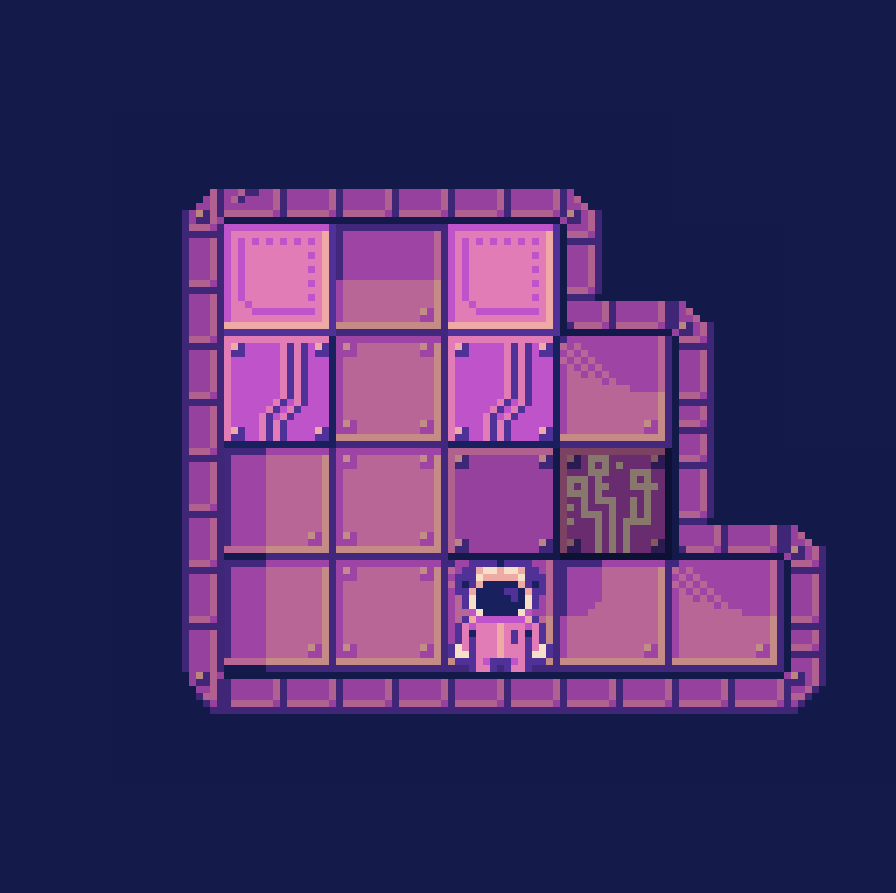

# Push
A top down block pushing game

## Mechanics
  * pushing blocks
  * buttons
  * go to next level
## Inspirations
  * Zelda
  * Fez
  * Portal
  * Half life
## Scope
  * player can push blocks in a top down environment
  * the player pushes these blocks in order to solve puzzles and progress through the game
  * the player is restricted to a grid
  * blocks cannot be pushed into other blocks
  * the next level unlocks when all buttons are pressed
 
